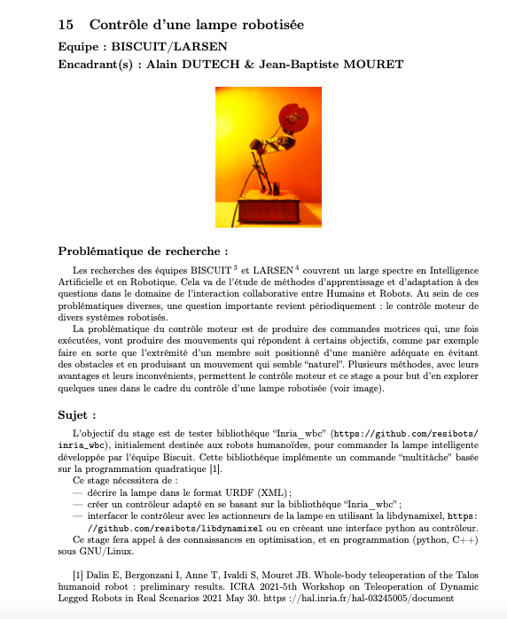

## Lampe-Robotique
Sujet d'initiation à la recherche avec la team BISCUIT

Tuteurs :
M. DUTECH Alain
M. MOURET Jean-Baptiste

Etudiants :
M. GSELL Paul
M. ZIMOL Guillaume
M. MOSELLE Marie-Luc

Using: 
https://img.shields.io/badge/C%2B%2B-00599C?style=for-the-badge&logo=c%2B%2B&logoColor=white

https://img.shields.io/badge/Python-3776AB?style=for-the-badge&logo=python&logoColor=white

## Sujet du projet

 

Un fichier PDF le décrivant est également disponible à la racine du projet (SUJET.pdf).

## Fichier URDF 

La première étape de notre initiation à la recherche était la représentation d'une lampe au format URDF. Cette première représentation est décrite dans le fichier "lampe_test.urdf".

## Rapport 

Notre rapport est en cours de rédaction, sur overleaf: https://www.overleaf.com/read/trcvkxkjskfy

## Présentation 

La présentation est disponible dans le fichier: Présentation_Recherche.pdf, celle-ci n'est pas encore fini.

